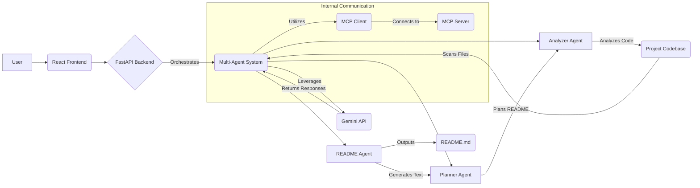

<p align="center">
  
</p>

<p align="center">
  A multi-agent AI documentation generator that analyzes project codebases to create comprehensive README.md files. It supports local paths and public GitHub repositories.
</p>

<p align="center">
  <a href="https://www.python.org" target="_blank">
    
  </a>
  <a href="https://fastapi.tiangolo.com/" target="_blank">
    
  </a>
  <a href="https://react.dev/" target="_blank">
    
  </a>
  <a href="https://developers.google.com/gemini" target="_blank">
    
  </a>
</p>

---

## ✨ Features

README Copilot is designed to revolutionize how project documentation is created. Leveraging a sophisticated multi-agent AI system, it deeply analyzes your codebase and project structure to generate production-quality README.md files.

-   **Intelligent Code Analysis**: Utilizes specialized AI agents to understand your project's technical profile, dependencies, and core functionalities.
-   **Multi-Agent Architecture**: Employs Analyzer, Planner, and README Agents working in concert to extract information, structure content, and generate coherent documentation.
-   **Supports Diverse Projects**: Capable of analyzing both local project directories and public GitHub repositories.
-   **Comprehensive Documentation**: Generates detailed sections including setup, usage, API references, architecture, and more.
-   **Flexible Interface**: Provides a powerful Command Line Interface (CLI) and an intuitive Web User Interface (UI) for generating READMEs.
-   **Configurable AI Models**: Integrates with Google Gemini, allowing configuration of the language model to be used.

---

## 🚀 Previews

Here are some visual glimpses of README Copilot in action:

<p align="center">
  
</p>

<p align="center">
  
  <em>Welcome Screen of the README Copilot Application</em>
</p>

<p align="center">
  
  <em>High-Level Architecture of README Copilot</em>
</p>

<p align="center">
  
  <em>Illustrative Workflow of the Multi-Agent System</em>
</p>

---

## 🛠️ Tech Stack

README Copilot is built with a robust combination of modern technologies:

-   **Backend**: Python, FastAPI
-   **Frontend**: React, Vite
-   **AI Integration**: Google Gemini API
-   **Package Managers**: `pip` (Python), `npm` (Node.js)
-   **Internal Communication**: MCP Client/Server

---

## 🌐 Architecture

README Copilot operates as a full-stack, multi-agent AI system. It comprises a React-based frontend, a FastAPI backend, and a sophisticated multi-agent system powered by Google Gemini, designed for comprehensive code analysis and README generation.

### Multi-Agent System

The core intelligence of README Copilot resides in its multi-agent system, which orchestrates specialized agents to perform distinct tasks:

1.  **Analyzer Agent**: Scans the project codebase to extract key information, identify technologies, and understand the project's purpose.
2.  **Planner Agent**: Takes the analysis results and formulates a structured plan for the README content, determining sections, sub-sections, and key points.
3.  **README Agent**: Utilizes the generated plan and extracted data to write the comprehensive and well-formatted README.md content.

All agents leverage the Gemini API for natural language understanding and generation, while the MCP (Multi-Agent Communication Protocol) Client/Server facilitates robust internal communication between the FastAPI backend and the agents.



---

## 📂 Project Structure

The project is organized into logical directories to separate concerns and enhance maintainability:

```
Smart ReadME/
|-- agents/              # Contains the core AI agents (Analyzer, Planner, README Agent)
|   |-- analyzer_agent.py
|   |-- planner_agent.py
|   +-- readme_agent.py
|-- docs/                # Project documentation, images, and supplementary materials
|   |-- images/
|   +-- ...
|-- frontend/            # React application source code
|   |-- public/
|   |-- src/
|   |   |-- App.jsx
|   |   +-- main.jsx
|   +-- ...
|-- mcp/                 # Multi-Agent Communication Protocol server
|   +-- server.py
|-- prompts/             # Markdown-based prompt templates for agents
|   |-- analyzer.md
|   |-- planner.md
|   +-- readme.md
|-- tools/               # Utility scripts and tools for agents (e.g., code parsing)
|   |-- detector.py
|   |-- markdown.py
|   |-- mcp_client.py
|   +-- parser.py
|-- api.py               # FastAPI application definition and routes
|-- app.py               # Main application entry point for the backend
|-- cli.py               # Command-Line Interface for README generation
|-- config.py            # Global configuration settings
|-- CONTRIBUTING.md      # Guidelines for contributors
|-- requirements.txt     # Python dependencies
+-- SECURITY.md          # Security policy and guidelines
```

---

## ⚙️ Installation & Setup

Follow these steps to get README Copilot up and running on your local machine.

### Prerequisites

-   **Python 3.8+**
-   **Node.js & npm** (Node.js 18+ recommended)

### 1. Clone the Repository

```bash
git clone https://github.com/your-username/Smart-ReadME.git
cd Smart-ReadME
```

### 2. Backend Setup (FastAPI & Python Agents)

1.  **Create a Virtual Environment** (recommended):
    ```bash
    python -m venv venv
    source venv/bin/activate  # On Windows: .\venv\Scripts\activate
    ```

2.  **Install Python Dependencies**:
    ```bash
pip install -r requirements.txt
    ```

3.  **Configure Environment Variables**:
    Create a `.env` file in the root directory of the project based on the example below:
    ```ini
    # .env
    GEMINI_API_KEY="YOUR_GEMINI_API_KEY"
    GEMINI_MODEL="gemini-2.5-flash"
    ```
    Replace `"YOUR_GEMINI_API_KEY"` with your actual Google Gemini API key. Refer to the [Configuration](#-configuration) section for more details.

4.  **Run the FastAPI Backend**:
    ```bash
uvicorn app:app --reload
    ```
    The backend API will be available at `http://localhost:8000`.

### 3. Frontend Setup (React UI)

1.  **Navigate to the Frontend Directory**:
    ```bash
    cd frontend
    ```

2.  **Install Node.js Dependencies**:
    ```bash
    npm install
    ```

3.  **Run the Frontend Development Server**:
    ```bash
    npm run dev
    ```
    The React UI will be available at `http://localhost:5173`.

---

## 📝 Configuration

README Copilot relies on environment variables for sensitive information and customizable settings.

-   **`GEMINI_API_KEY`**: Your API key for authenticating with the Google Gemini API. **This is a mandatory variable.**
-   **`GEMINI_MODEL`**: Specifies the particular Gemini model to use for AI operations. Defaults to `gemini-2.5-flash` if not specified. You can change this to `gemini-1.5-pro` or other available models.

These variables should be set in a `.env` file in the project root to ensure they are not committed to version control. Refer to `SECURITY.md` for more details on secure handling.

---

## 🚀 Usage

README Copilot offers both a command-line interface and a web-based UI for generating documentation.

### Via Command-Line Interface (CLI)

The `cli.py` script provides a direct way to generate READMEs from your terminal.

1.  **Activate your Python virtual environment** (if not already active):
    ```bash
    source venv/bin/activate
    ```

2.  **Generate a README for a local path**:
    ```bash
    python cli.py generate --path "./my_project_folder" --output "./my_project_folder/README.md"
    ```
    Replace `./my_project_folder` with the actual path to your project. The generated README will be saved to the specified output file.

### Via Web User Interface (UI)

Once both the backend and frontend are running, open your web browser and navigate to:

```
http://localhost:5173
```

The UI provides an intuitive form to input your project's details (local path or GitHub URL) and initiate the README generation process.

### Via REST API

You can also interact directly with the FastAPI backend.

**Generate README (POST /api/generate)**

```bash
curl -X POST \
  http://localhost:8000/api/generate \
  -H "Content-Type: application/json" \
  -d '{ "path": "./", "github_repo_url": null }'
```

Replace `./` with your desired local project path, or provide a `github_repo_url` (e.g., `"https://github.com/owner/repo"`).

---

## 📞 API Reference

The FastAPI backend exposes the following endpoints:

### `POST /api/generate`

Initiates the README generation process for a specified project.

-   **Request Body**: `application/json`
    ```json
    {
      "path": "string",         // Optional: Local path to the project directory. Provide EITHER path OR github_repo_url.
      "github_repo_url": "string" // Optional: Public GitHub repository URL. Provide EITHER path OR github_repo_url.
    }
    ```
-   **Response**: `application/json`
    ```json
    {
      "status": "string",        // e.g., "success", "error"
      "message": "string",       // Description of the operation result
      "readme_content": "string" // The generated Markdown content, if successful
    }
    ```

### `GET /api/health`

Checks the health and availability of the API service.

-   **Response**: `application/json`
    ```json
    {
      "status": "string", // "ok" if the service is running
      "message": "string" // "API is healthy"
    }
    ```

---

## 🗺️ Roadmap

Our future plans for README Copilot include:

-   **Add new technology parsers**: Continuously expand support for more programming languages, frameworks, and tools.

---

## 🤝 Contributing

We welcome contributions to README Copilot! Whether it's bug reports, feature requests, or code contributions, your help is invaluable.

Please refer to our [CONTRIBUTING.md](CONTRIBUTING.md) guide for detailed information on how to get started, including:

-   Reporting bugs and submitting feature requests.
-   Development standards (PEP 8, type hints, docstrings).
-   Agent development guidelines.
-   Security best practices (e.g., never committing `.env` files).
-   How to submit pull requests.

---

## 🔒 Security

README Copilot prioritizes security, especially concerning API keys and sensitive project data.

Please review our [SECURITY.md](SECURITY.md) document for comprehensive information on:

-   Reporting security vulnerabilities.
-   Best practices for handling environment variables, specifically `GEMINI_API_KEY`.
-   Security checks and measures implemented within the project.

**Important**: The project expects `GEMINI_API_KEY` to be set in a `.env` file. Never commit your `.env` file or sensitive API keys directly to your codebase.

---

## 📜 License

No specific license information was detected on disk.
