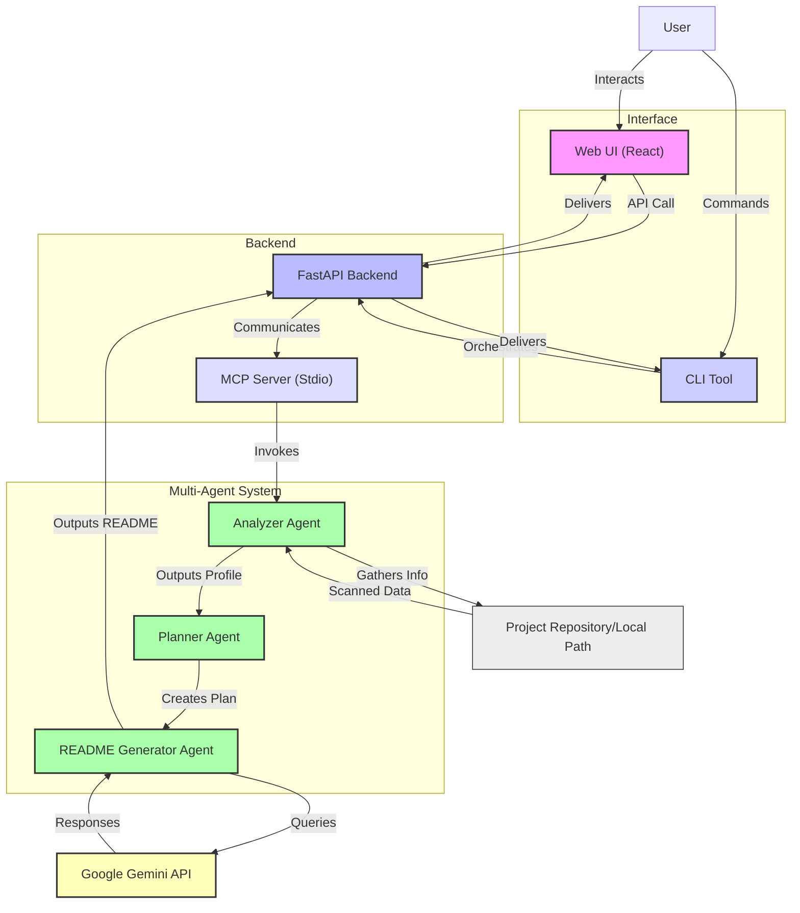

<div align="center">

  
  <h1>README Copilot</h1>

  <p>A multi-agent AI documentation generator leveraging Google Gemini for outstanding GitHub READMEs.</p>

  <p>
    <a href="https://github.com/your-org/readme-copilot/blob/main/LICENSE">
      
    </a>
    
    
    
    
  </p>

  <p>
    • <a href="#features">Features</a>
    • <a href="#previews--screenshots">Previews</a>
    • <a href="#tech-stack">Tech Stack</a>
    • <a href="#architecture">Architecture</a>
    • <a href="#installation--configuration">Installation</a>
    • <a href="#cli--api-reference">Usage</a>
    • <a href="#roadmap">Roadmap</a>
    • <a href="#contributing">Contributing</a>
  </p>
</div>

---

## ✨ Features

README Copilot is designed to streamline the creation of high-quality `README.md` files for any project, local or remote. It employs a sophisticated multi-agent system powered by Google Gemini to analyze, plan, and generate comprehensive documentation.

### ⚙️ Core Capabilities

- **Automated README Generation**: Generate detailed and structured README files from project analysis.
- **Project Analysis**: Intelligently analyze local project paths or remote GitHub repository URLs.
- **Multi-Agent Orchestration**: Utilizes a specialized multi-agent pipeline for robust documentation generation.
- **Web & CLI Interfaces**: Provides both a user-friendly web interface (React) and a powerful command-line tool for flexibility.

### 🤖 AI Integration & Agents

- **Analyzer Agent**: Scans project structure, identifies technologies, and extracts key information.
- **Planner Agent**: Develops a logical and comprehensive outline for the README based on project insights.
- **README Generator Agent**: Crafts high-quality markdown content for each section, leveraging Google Gemini's capabilities.
- **Google Gemini Integration**: Leverages advanced Generative AI for content creation, ensuring relevant and context-aware documentation.

### 🛠️ Developer-First Tooling

- **FastAPI Backend**: A robust and scalable backend for handling API requests and orchestrating agent workflows.
- **MCP (Multi-Agent Communication Protocol) Server**: Facilitates seamless communication and coordination between various AI agents.
- **Configurable Settings**: Easily customize agent behavior, timeouts, and excluded directories/files via environment variables.

## 📸 Previews & Screenshots

Here are some glimpses of README Copilot in action:

<p align="center">
  
  <br/>
  <em>Initial welcome screen of the README Copilot application.</em>
</p>

<p align="center">
  
  <br/>
  <em>Project banner highlighting key features.</em>
</p>

<p align="center">
  
  <br/>
  <em>Visual illustration of the multi-agent workflow.</em>
</p>

<p align="center">
  
  <br/>
  <em>High-level architectural overview.</em>
</p>

## 🚀 Tech Stack

README Copilot is built with a modern and efficient technology stack to ensure performance, scalability, and an excellent developer experience.

| Category        | Technology     | Description                                                               | Why it's suitable                                                    |
| :-------------- | :------------- | :------------------------------------------------------------------------ | :------------------------------------------------------------------- |
| **Backend**     | Python         | The core language for AI agents and backend logic.                        | Robust ecosystem for AI/ML, strong community support, readability.   |
|                 | FastAPI        | High-performance web framework for building APIs.                         | Asynchronous capabilities, automatic OpenAPI/Swagger documentation.  |
| **Frontend**    | React          | A JavaScript library for building user interfaces.                        | Component-based, efficient DOM updates, rich ecosystem for web apps. |
| **AI Engine**   | Google Gemini  | Advanced large language model for content generation.                     | State-of-the-art generation capabilities, versatile for diverse tasks. |
| **Package Mgmt.** | `pip`, `npm`   | Python and Node.js package managers.                                      | Standard tools for dependency management in their respective ecosystems. |
| **Tools**       | Docker         | Containerization for consistent development and deployment environments.  | Ensures consistent environments across different setups (though not explicitly used for deployment targets, it's a good practice).|

## 🏛️ Architecture

README Copilot employs a modular, multi-agent architecture designed for extensibility and efficiency.

### System Components Diagram



### User Workflow Sequence Diagram

This sequence diagram illustrates the typical data flow and agent interactions when generating a README.

```mermaid
sequenceDiagram
    actor User
    User->>+WebUI/CLI: Submit Project (Path/URL)
    WebUI/CLI->>FastAPI: POST /api/generate
    FastAPI->>+MCP_Server: Initialize Agent Pipeline
    MCP_Server->>+AnalyzerAgent: Start Analysis (Project Path/URL)
    AnalyzerAgent->>ProjectFiles: Read Files & Structure
    ProjectFiles-->>AnalyzerAgent: Project Data & Metadata
    AnalyzerAgent-->>MCP_Server: Returns Project Profile
    MCP_Server->>+PlannerAgent: Develop README Plan
    PlannerAgent-->>MCP_Server: Returns README Outline
    MCP_Server->>+GeneratorAgent: Generate README Content
    GeneratorAgent->>GeminiAPI: Prompt for Section Content
    GeminiAPI-->>GeneratorAgent: Generated Text Snippets
    GeneratorAgent-->>MCP_Server: Returns Final Markdown
    MCP_Server-->>-FastAPI: Generated README Document
    FastAPI-->>-WebUI/CLI: README Content (Markdown)
    WebUI/CLI->>User: Display/Save README
```

## 📁 Directory Structure

The project is organized into logical directories to separate concerns and facilitate maintainability.

```
Smart ReadME/
|-- agents/
|   |-- analyzer_agent.py
|   |-- planner_agent.py
|   +-- readme_agent.py
|-- docs/
|   |-- images/
|   |-- agent-design.md
|   |-- architecture.md
|   |-- demo-script.md
|   |-- kaggle-writeup.md
|   |-- mcp.md
|   |-- project-structure.md
|   |-- screenshots.md
|   |-- setup.md
|   +-- submission-checklist.md
|-- frontend/
|   |-- public/
|   |-- src/
|   |   |-- assets/
|   |   |-- App.jsx
|   |   +-- main.jsx
|   |-- .oxlintrc.json
|   |-- package-lock.json
|   |-- package.json
|   |-- README.md
|   +-- vite.config.js
|-- mcp/
|   +-- server.py
|-- prompts/
|   |-- analyzer.md
|   |-- planner.md
|   +-- readme.md
|-- tools/
|   |-- detector.py
|   |-- markdown.py
|   |-- mcp_client.py
|   +-- parser.py
|-- api.py
|-- app.py
|-- CHANGELOG.md
|-- cli.py
|-- CODE_OF_CONDUCT.md
|-- config.py
|-- CONTRIBUTING.md
|-- README.md
|-- requirements.txt
|-- SECURITY.md
|-- test_api.py
+-- test_validation.py
```

### Folder Summary

| Directory       | Description                                                                 |
| :-------------- | :-------------------------------------------------------------------------- |
| `agents/`       | Contains the core AI agents (Analyzer, Planner, Generator) responsible for README creation. |
| `docs/`         | Stores project documentation, architectural notes, and image assets.        |
| `frontend/`     | Houses the React-based web user interface, including static assets and source code. |
| `mcp/`          | Implements the Multi-Agent Communication Protocol (MCP) server for agent coordination. |
| `prompts/`      | Stores markdown templates and instructions used by the agents to guide Gemini. |
| `tools/`        | Provides utility scripts for project analysis, markdown processing, and MCP client interactions. |
| `api.py`        | The main FastAPI application entry point, defining the web API endpoints.   |
| `cli.py`        | The command-line interface entry point for generating READMEs without the web UI. |
| `config.py`     | Centralized configuration settings and environment variable loading.        |
| `requirements.txt`| Lists all Python dependencies required for the backend.                     |
| `CHANGELOG.md`  | Documents all notable changes to the project.                               |
| `CONTRIBUTING.md`| Guidelines for contributing to the project.                                |
| `LICENSE`       | The project's license information.                                          |
| `README.md`     | This documentation file.                                                    |

## ⚙️ Installation & Configuration

To get README Copilot up and running, follow these steps.

### Local Environment Setup

1.  **Clone the repository:**
    ```bash
    git clone https://github.com/your-org/readme-copilot.git
    cd readme-copilot
    ```

2.  **Set up Python backend:**
    Create and activate a virtual environment:
    ```bash
    python -m venv venv
    source venv/bin/activate  # On Windows, use `venv\Scripts\activate`
    ```
    Install Python dependencies:
    ```bash
    pip install -r requirements.txt
    ```

3.  **Set up React frontend:**
    Navigate to the frontend directory and install dependencies:
    ```bash
    cd frontend
    npm install
    cd ..
    ```

### Configuration

Create a `.env` file in the project root directory based on `.env.example` (if provided, otherwise create manually) and populate it with necessary environment variables:

```ini
# .env example
GEMINI_API_KEY="your_google_gemini_api_key_here"
DEFAULT_MODEL="gemini-1.5-flash"
PIPELINE_TIMEOUT_SECONDS=600
GIT_CLONE_TIMEOUT_SECONDS=120
EXCLUDE_DIRS="venv,node_modules,build,.git,docs,frontend/public"
EXCLUDE_FILES=".env,.DS_Store,README.md,package-lock.json"
```

| Environment Variable      | Description                                                | Example Value                 |
| :------------------------ | :--------------------------------------------------------- | :---------------------------- |
| `GEMINI_API_KEY`          | API key for accessing Google Gemini services.              | `AIzaSyB-xxxxxxxxxxxxxxxxxxxx`|
| `DEFAULT_MODEL`           | The default Gemini model to use for content generation.    | `gemini-1.5-flash`            |
| `PIPELINE_TIMEOUT_SECONDS`| Overall timeout for the README generation pipeline.        | `600` (10 minutes)            |
| `GIT_CLONE_TIMEOUT_SECONDS`| Timeout for Git repository cloning operations.             | `120` (2 minutes)             |
| `EXCLUDE_DIRS`            | Comma-separated list of directories to exclude from scans. | `venv,node_modules,.git`      |
| `EXCLUDE_FILES`           | Comma-separated list of files to exclude from scans.       | `.env,README.md`              |

### Running the Application

1.  **Start the FastAPI backend:**
    From the project root directory, activate your virtual environment (if not already):
    ```bash
    source venv/bin/activate
    uvicorn api:app --host 0.0.0.0 --port 8050 --reload
    ```
    The API will be available at `http://localhost:8050`.

2.  **Start the React frontend:**
    In a **new terminal**, navigate to the `frontend` directory:
    ```bash
    cd frontend
    npm run dev
    ```
    The frontend will typically be served at `http://localhost:5173`.

## 📖 CLI & API Reference

README Copilot offers both a web API for programmatic access and a command-line interface for direct interaction.

### Web API

The FastAPI backend exposes several endpoints:

-   **Swagger UI**: `http://localhost:8050/docs`
-   **ReDoc**: `http://localhost:8050/redoc`

#### Endpoints

-   `POST /api/generate`
    -   **Description**: Initiates the README generation process for a given project path or GitHub URL.
    -   **Request Body Example (JSON)**:
        ```json
        {
          "project_path": "/path/to/your/local/project",
          "github_url": "https://github.com/owner/repo"
        }
        ```
        *(Note: Provide either `project_path` or `github_url`, not both.)*
    -   **cURL Example**:
        ```bash
        curl -X POST "http://localhost:8050/api/generate" \
             -H "Content-Type: application/json" \
             -d '{"project_path": "/path/to/your/project"}'
        ```

-   `GET /api/health`
    -   **Description**: Checks the health and availability of the API service.
    -   **Response**: `{"status": "ok"}`

### Command Line Interface (CLI)

The CLI tool in `cli.py` allows for direct README generation from your terminal.

#### Usage

```bash
python cli.py generate --path <project_path> [--output <output_file>] [--github-url <github_repo_url>]
```

-   `generate`: Command to start the README generation.
-   `--path <project_path>`: (Optional) Local path to the project directory.
-   `--github-url <github_repo_url>`: (Optional) URL of the GitHub repository.
-   `--output <output_file>`: (Optional) Specify the output file name (default: `README.md`).

#### Example

```bash
# Generate README for a local project
python cli.py generate --path ./my_awesome_project --output MY_README.md

# Generate README for a GitHub repository
python cli.py generate --github-url https://github.com/openai/whisper
```

## ☁️ Deployment, Security & Performance

### Deployment

This project is designed for flexible deployment. While no specific cloud targets are pre-configured in this repository, the containerized nature of the FastAPI backend and static build of the React frontend make it suitable for platforms like:

-   **Cloud VMs**: Deploy the backend on a VM (e.g., AWS EC2, Google Compute Engine) and serve the frontend statically (e.g., Nginx, Apache).
-   **PaaS**: Services like Railway, Render, or Heroku (for the backend) and Vercel, Netlify, or GitHub Pages (for the frontend) are excellent choices.
-   **Docker**: For production, containerize both the FastAPI backend and React frontend using Docker Compose to ensure consistent environments.

### Security

-   **Environment Variables**: Sensitive information like `GEMINI_API_KEY` is managed via environment variables, preventing hardcoding.
-   **Input Validation**: The FastAPI backend performs validation on incoming requests to prevent malformed data or malicious inputs.
-   **CORS**: Cross-Origin Resource Sharing (CORS) is configured within the FastAPI application to restrict frontend access to trusted origins, enhancing security.
-   **Dependency Scanning**: Regular updates of `requirements.txt` and `package.json` dependencies are recommended to mitigate known vulnerabilities.

### Performance

-   **Asynchronous Operations**: FastAPI's async capabilities ensure efficient handling of I/O-bound tasks, crucial for API calls to Gemini and file system operations.
-   **Timeouts**: Configurable `PIPELINE_TIMEOUT_SECONDS` and `GIT_CLONE_TIMEOUT_SECONDS` prevent agents from hanging indefinitely, improving overall stability and responsiveness.

## 🗺️ Roadmap

We are continuously working to improve README Copilot. Here's a glimpse of what's planned and what's in progress:

### Current Focus

-   **FIX**: Update `api.py` to use `asyncio.get_running_loop()` instead of the deprecated `get_event_loop()` for better future compatibility.
-   **Deprecation Notice**: Implement a backwards-compatible alias for `GEMINI_MODEL` in `config.py` with a clear deprecation warning.
-   **Enhancement**: Consider logging a warning when markdown validation in `tools/markdown.py` detects placeholders, prompting better AI output.

### Future Enhancements

-   **Custom Templates**: Allow users to provide their own markdown templates for README generation.
-   **Multi-Language Support**: Extend analysis and generation capabilities to projects written in other programming languages (e.g., JavaScript, Go, Java).
-   **Dynamic Agent Configuration**: Implement a more flexible way to configure agent behaviors and prompts without code changes.
-   **Interactive Output Editor**: Integrate a live markdown editor in the web UI for post-generation refinements.

## 🤝 Contributing

We welcome contributions from the community! If you're interested in making this project even better, please review our contribution guidelines.

### How to Contribute

1.  **Fork the repository** and clone it to your local machine.
2.  **Create a new branch** for your feature or bug fix.
3.  Ensure your code adheres to **PEP 8 style guidelines** and includes **type hints**.
4.  Add **descriptive docstrings** to all new functions and classes.
5.  **Avoid committing sensitive `.env` variables** or large binary files.
6.  **Test your changes** thoroughly.
7.  **Submit a pull request** with a clear and concise description of your changes.

For more detailed instructions, please refer to the [CONTRIBUTING.md](CONTRIBUTING.md) file.

## 📄 License

This project is licensed under the **MIT License** - see the [LICENSE](LICENSE) file for details.

## 🙏 Acknowledgements

-   Special thanks to the open-source community for inspiration and tools.
-   Powered by Google Gemini for intelligent content generation.

---

Project maintained by the README Copilot Team.
For support or inquiries, please open an issue on GitHub.
</div>