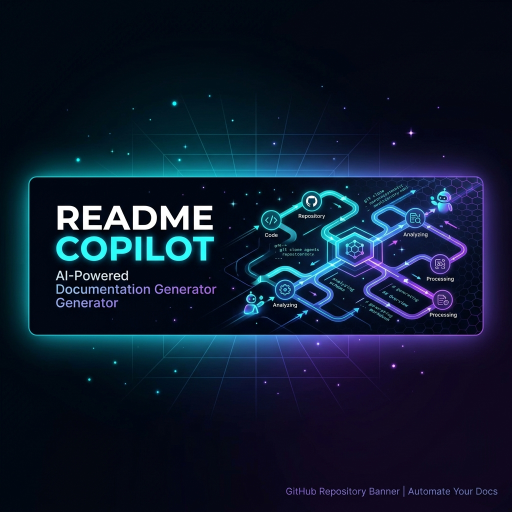
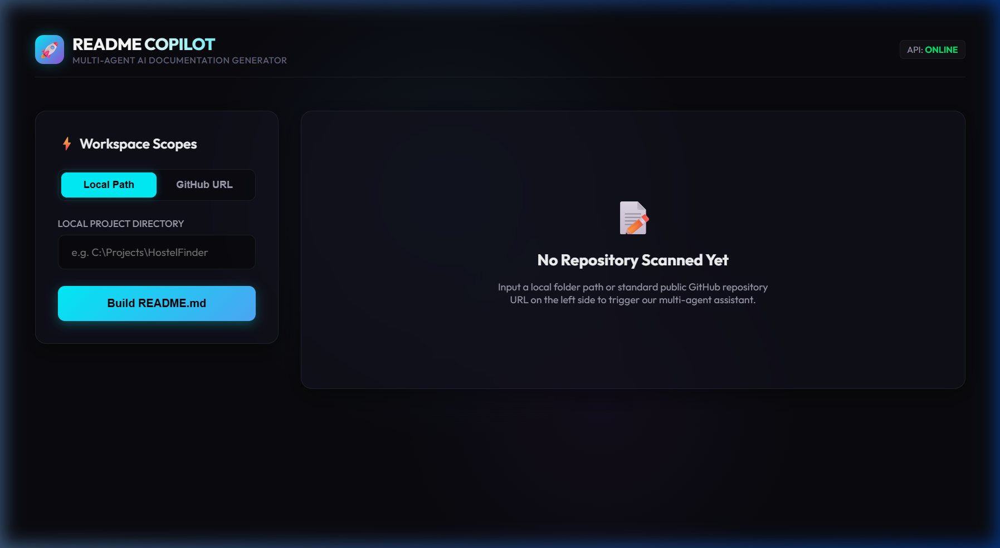
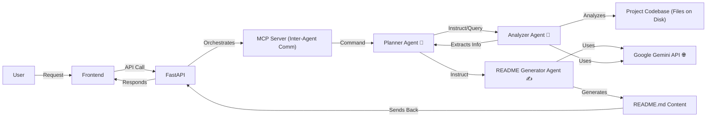

# 👋 README Copilot: Your AI-Powered Documentation Generator


README Copilot is a sophisticated multi-agent AI system designed to autonomously generate comprehensive, production-quality `README.md` files for any codebase. Leveraging the power of Google Gemini, this project analyzes your repository's structure, technologies, and intent to craft detailed documentation, saving developers valuable time.

Built with a FastAPI backend for robust API services, a dynamic React frontend for an intuitive user experience, and a Typer-based command-line interface for developer convenience, README Copilot employs an intelligent Multi-Agent Communication Protocol (MCP) to orchestrate its specialized AI agents.

## ✨ Key Features

*   **Intelligent Codebase Analysis**: Deeply inspects project structure, dependencies, and code patterns.
*   **Multi-Agent Architecture**: Utilizes specialized AI agents (Planner, Analyzer, README Generator) for distinct tasks.
*   **Google Gemini Integration**: Harnesses advanced LLM capabilities for accurate and contextual content generation.
*   **Full-Stack Experience**: Offers both a responsive React web interface and a powerful Typer CLI.
*   **Customizable Output**: Generates visually stunning and technically precise `README.md` files.
*   **Modular & Extensible**: Designed with MCP for scalable inter-agent communication.

## 🚀 Previews & Screenshots

Take a look at README Copilot in action:


_Overall Architecture of README Copilot_


_Showcasing the project banner_


_The official project logo_


_The welcoming interface of the React frontend_


_An illustration of the agent workflow_

## 🧠 Agent Architecture

README Copilot operates through a meticulously designed multi-agent system, orchestrated to collaborate and achieve the goal of high-quality README generation. The core components include a React Frontend, a FastAPI Backend, an MCP Server for inter-agent communication, and specialized AI Agents powered by Google Gemini.



### 💡 Workflow & Data Lifecycle

1.  **User Request**: A user initiates a README generation request either via the React frontend or the Typer CLI.
2.  **API Gateway**: The request is routed through the FastAPI backend, which acts as the central orchestrator.
3.  **MCP Orchestration**: FastAPI communicates with the `mcp/server.py` to manage inter-agent messages and state.
4.  **Planner Agent**: The `planner_agent.py` receives the initial request and determines the overall strategy for README generation. It breaks down the task into smaller sub-tasks.
5.  **Analyzer Agent**: The `analyzer_agent.py` is invoked by the Planner. It thoroughly scans the project codebase, leveraging internal `tools/parser.py` and `tools/detector.py` to identify programming languages, frameworks, dependencies, and core functionalities. It may also interact with the Google Gemini API to extract higher-level insights from code snippets or documentation within the codebase.
6.  **Information Synthesis**: The Analyzer returns structured information about the codebase to the Planner.
7.  **README Generator Agent**: Based on the synthesized information and the overall plan, the `readme_agent.py` is activated. It utilizes its dedicated prompts (`prompts/readme.md`) and interacts with the Google Gemini API to draft the various sections of the `README.md`.
8.  **Content Delivery**: The generated Markdown content is returned to the FastAPI backend, which then serves it back to the React frontend or the CLI.

## ⚙️ Installation & Setup

Follow these steps to get README Copilot up and running on your local machine.

###  prerequisites

*   Python 3.9+
*   Node.js & npm (for the frontend)

### 1. Clone the Repository

```bash
git clone https://github.com/your-username/Smart-ReadME.git
cd Smart-ReadME
```

### 2. Backend Setup (FastAPI & Agents)

Navigate to the project root and install Python dependencies:

```bash
pip install -r requirements.txt
```

### 3. Frontend Setup (React)

Navigate into the `frontend/` directory and install JavaScript dependencies:

```bash
cd frontend
npm install
cd ..
```

## 🔑 Configuration

README Copilot requires specific environment variables for its operation, particularly for integrating with Google Gemini.

Create a `.env` file in the project root directory (e.g., `Smart ReadME/.env`) and populate it with the following variables:

```ini
GEMINI_API_KEY="YOUR_GOOGLE_GEMINI_API_KEY"
DEFAULT_MODEL="gemini-1.5-flash"
GEMINI_MODEL="gemini-1.5-flash"
```

*   `GEMINI_API_KEY`: Your Google Gemini API key for authentication with the Gemini service. Obtain it from the [Google AI Studio](https://makersuite.google.com/k/api_key).
*   `DEFAULT_MODEL`: Specifies the default Gemini model to use for AI operations (e.g., `gemini-1.5-flash`, `gemini-1.5-pro`).
*   `GEMINI_MODEL`: An alias or specific override for the Gemini model to be used by agents.

## 🚀 Usage

README Copilot can be used via its web interface or through the command-line interface.

### Web Interface

1.  **Start the Backend (FastAPI)**:
    In the project root directory, run:
    ```bash
uvicorn app:app --host 0.0.0.0 --port 8000 --reload
    ```
    The API documentation will be available at [http://localhost:8000/docs](http://localhost:8000/docs).

2.  **Start the Frontend (React)**:
    In a separate terminal, navigate to the `frontend/` directory and run:
    ```bash
npm run dev
    ```
    The React application will typically be available at [http://localhost:5173](http://localhost:5173) (or similar, depending on Vite's output).

    Interact with the web UI to provide your project details and generate a README.

### Command-Line Interface (CLI)

README Copilot includes a powerful CLI for direct interaction. From the project root directory, you can execute generation commands:

```bash
python cli.py generate --path .
```

Replace `.` with the path to your project directory if it's not the current working directory.

#### Available API Endpoints

The FastAPI backend exposes the following key endpoints:

*   `/api/generate`: Initiates the README generation process.
*   `/api/health`: Provides a health check for the backend service.
*   `/docs`: Access the interactive OpenAPI (Swagger UI) documentation.

## 📂 Project Structure

The repository is organized into distinct directories for clarity and modularity:

```
Smart ReadME/
├── agents/              # Contains the core AI agent implementations (Planner, Analyzer, README Generator)
├── docs/                # Project documentation, images, and supplementary materials
├── frontend/            # React application source code and build configurations
├── mcp/                 # Multi-Agent Communication Protocol (MCP) server implementation
├── prompts/             # Markdown-based prompt templates for various agents
├── tools/               # Utility scripts and helper functions for agents (e.g., parsers, detectors)
├── api.py               # FastAPI application definition and routing
├── app.py               # Main application entry point
├── cli.py               # Typer-based command-line interface
├── config.py            # Global configuration settings
└── requirements.txt     # Python dependencies
```

## 🗺️ Roadmap

Our future plans for README Copilot include:

*   **Add new technology parsers**: Continuously expand support for more programming languages, frameworks, and tools.

## 🤝 Contributing

We welcome contributions to README Copilot! Please refer to our [CONTRIBUTING.md](CONTRIBUTING.md) for detailed guidelines on reporting bugs, development standards (PEP 8, type hints, docstrings), agent development, security best practices, and submitting pull requests.

## 📄 License

This project is licensed under the [MIT License](LICENSE.md).
