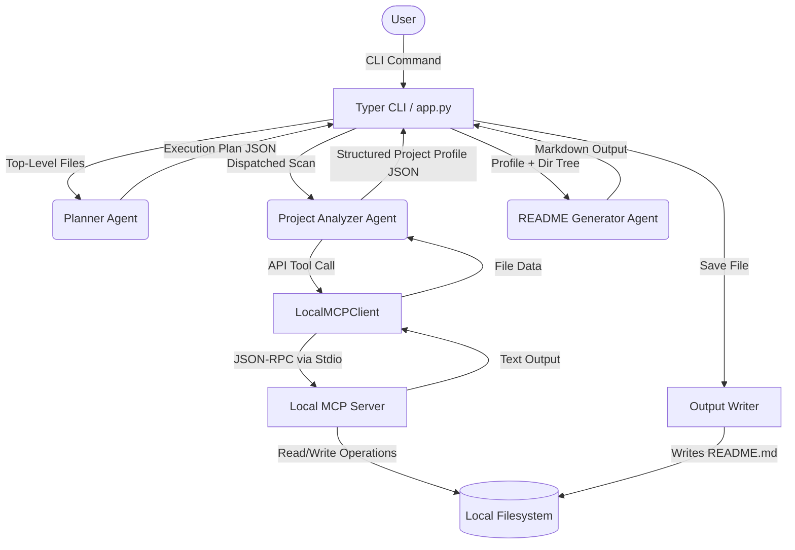
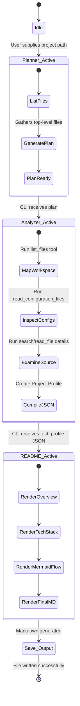
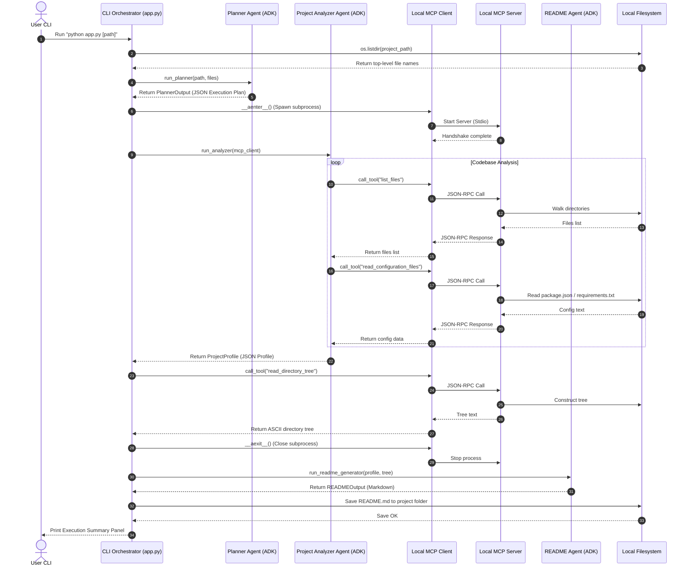
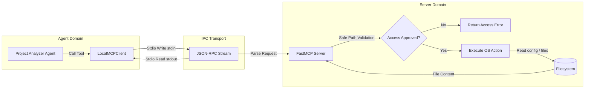

# System Architecture Deep-Dive

This document details the software design, agent interaction model, and data flows of the README Copilot application.

---

## 🏛️ High-Level System Architecture

README Copilot decouples user interfaces, AI orchestration, and system interfaces. The CLI interacts with the Google ADK Agents using clean schemas, and the agents interact with the filesystem using the Model Context Protocol (MCP).

---

## 🤖 Agent Workflow Diagram

This state diagram illustrates the multi-agent execution pipeline. The CLI coordinates execution sequentially to avoid prompt nesting overhead.

---

## ⏱️ System Sequence Diagram

This sequence diagram maps the chronological function calls and message exchanges between components.

---

## 🔌 MCP Data Interaction Diagram

This diagram shows how the filesystem request operations map between the Project Analyzer Agent and the Local MCP Server.

---

## ⚙️ Component Responsibilities

### 1. Planner Agent
- **Role**: Coordinates expected steps, expected deliverables, and checklist items.
- **Constraints**: Never reads code contents or writes markdown instructions. Maintains clean sequence task layout.

### 2. Project Analyzer Agent
- **Role**: Dispatches MCP tool calls to inspect configuration settings, language targets, and environment settings.
- **Constraints**: Converts all parameters into a strict Pydantic JSON structure to ensure type safety.

### 3. README Generator Agent
- **Role**: Authors the final documentation.
- **Constraints**: Generates a valid Mermaid sequence or flowchart map representing the target app flow.

### 4. Local MCP Server
- **Role**: Safe broker for disk activities.
- **Constraints**: Excludes folders like `node_modules/` and prevents access to `.env` or credential files.

### 5. CLI & App Orchestrator
- **Role**: Handles Typer parsing, loads environmental `.env` files, starts the MCP subprocess, handles event logs, and saves the output.
- **Constraints**: Renders console warnings and execution details using Rich.
